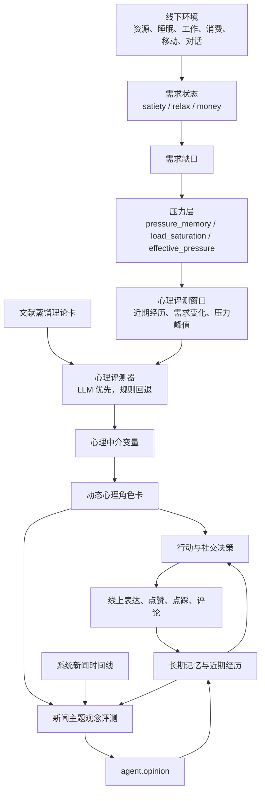

# 组会汇报：线上-线下社会仿真沙盒中的心理中介与观念动态建模

更新时间：2026-06-29  
项目位置：`D:\agent\Agent`  
汇报定位：阶段性研究进展，而非工程技术清单。

## 1. 汇报摘要

本项目尝试构建一个线上-线下联动的社会仿真沙盒，用于研究个体生活状态、心理中介变量与线上舆论表达之间的关系。与单纯的社交平台仿真不同，本项目将智能体置于一个具有资源、行动、互动和记忆的线下环境中，再观察其在线上平台中的信息接触、表达、互动与观念变化。

当前阶段已经完成一个可运行原型。系统能够在每个时间步中同时推进线下生活、社交平台、长期记忆、需求状态、压力累积、心理评测、动态角色卡和新闻主题观念评测。现阶段的核心研究主张是：线下经历不应只作为背景文本进入 LLM，而应通过需求缺口、压力累积和心理中介层影响智能体的注意、表达、社交倾向与观念评测过程。

项目目前仍处于方法原型阶段。主要贡献还不是实验结论，而是提出并实现了一条可检验的建模链路：

```text
线下生活状态
-> 需求缺口
-> 压力累积
-> 心理中介变量
-> 动态心理角色卡
-> 行动、社交表达与新闻主题观念评测
```

## 2. 研究背景与问题

现有 LLM 智能体社会仿真通常更关注记忆、规划、对话和社会互动，但对于“线下生活状态如何影响线上观念表达”这一问题，仍缺少清晰机制。很多系统可以让智能体阅读帖子、发表评论、进行对话，但线下饥饿、疲劳、经济压力、被排斥、被认可等状态如何转化为线上表达差异，往往没有显式建模。

本项目希望回答三个问题：

1. 线下环境中的需求缺口能否通过压力累积影响智能体的心理表征？
2. 心理表征是否会进一步改变智能体的行动、社交表达和新闻观念评测？
3. 相比直接让 LLM 根据上下文自由生成行为，文献约束的心理中介层是否能提高可解释性和可验证性？

这里的目标不是声称复现真实人类心理，而是构建一个可记录、可消融、可解释的仿真机制，用于研究需求压力如何调节 LLM 智能体的行为与观念表现。

## 3. 理论动机

本项目的理论出发点是：LLM 可以生成类似心理状态的语言表现，但不应被直接视为具备人类式、具身化、持续演化的心理机制。因此，如果研究目标是“心理状态如何由需求受挫和经历逐步形成”，就需要在 LLM 外部显式建模需求状态、压力负荷和心理中介变量。

当前建模借鉴了三个方向：

1. **具身与稳态调节视角**  
   情绪和心理状态与身体内部状态、稳态调节和预测有关。对应到智能体中，`satisfaction`、`need_gap` 和 `effective_pressure` 用于模拟智能体对自身状态的读取和调节压力。

2. **基本需求与心理中介视角**  
   需求受挫并不只导致行为目标变化，还可能引发疲劳、焦虑、防御、资源寻求、社会监测、从众或认可寻求等中介变量。这些中介变量更适合解释“以什么方式行动和表达”。

3. **LLM 智能体外置机制视角**  
   现有可信智能体通常依赖记忆、反思、规划等外置结构。本项目进一步增加心理状态层，使心理变化不是 LLM 即兴生成，而是由需求压力和理论卡共同约束。

## 4. 当前方法框架

### 4.1 总体框架



该框架的核心不是让心理模块直接决定行为，而是让心理模块调节智能体的认知偏置、表达风格、社交倾向和决策偏好。最终行动仍由智能体结合环境、工具规则、记忆和任务状态生成。

### 4.2 需求层

当前原型中已经实际接入三个需求维度：

| 需求键 | 含义 | 当前满足渠道 |
|---|---|---|
| `satiety` | 饱腹需求 | 地图食物、食品店 |
| `relax` | 休息/放松需求 | 睡觉、游乐场、无任务时轻微恢复 |
| `money` | 经济安全代理变量 | 公司工作获得，消费时减少 |

其中 `satiety` 和 `relax` 代表生理层，`money` 暂时作为安全需求的代理变量。

### 4.3 急迫度与层级约束

需求满足度越低，主观急迫度越高。当前使用简化线性公式：

\[
g_k=\max\left(0,\frac{\theta_k-s_k}{\theta_k}\right)
\]

\[
u_k=\mathrm{clip}\left(u_k^{floor}+\alpha_k g_k,\ u_k^{floor},1\right)
\]

其中 \(s_k\) 是需求满足度，\(\theta_k\) 是满足阈值，\(g_k\) 是归一化缺口，\(u_k\) 是急迫度。

系统还加入了层级规则：当生理层未满足时，高层需求的急迫度不会超过生理层形成的上限。这样可以避免在严重饥饿或疲劳时，安全、尊重、自我实现等高层需求在行动优先级上不合理地压过低层需求。

### 4.4 压力层

项目进一步区分“瞬时缺口”和“长期压力负荷”。当需求持续得不到满足时，系统累积 `pressure_memory`；当需求恢复后，压力记忆逐步衰减，而不是立即归零。

压力负荷使用指数饱和形式：

\[
L_k=1-e^{-\frac{m_k}{\kappa_k}}
\]

有效压力由瞬时缺口、残余负荷和二者交互共同决定：

\[
P_k=w_c g_k+w_r L_k+w_a g_kL_k
\]

其中 \(m_k\) 是压力记忆，\(L_k\) 是压力负荷饱和度，\(P_k\) 是有效压力。该设计用于表达一个核心假设：长期压力不等于当前缺口，但会调节当前心理反应。

### 4.5 心理中介层

心理评测每隔固定时间窗口执行一次。系统在窗口内收集：

- 智能体近期经历；
- 需求满足度变化；
- 各需求的最大有效压力；
- 各需求的最新有效压力；
- 上一次该需求评测结果；
- 当前任务和近期历史。

当某一需求在窗口内的有效压力超过阈值时，对应理论卡被激活。评测器输出：

- 心理中介变量；
- 动态心理角色卡；
- 评测理由；
- 证据；
- 置信度。

如果多个需求同时激活，裁判模块会把多个理论卡输出整合为统一角色卡。

当前已经实际接通的理论卡包括 `satiety`、`relax` 和 `money`。理论卡文件中还保留了 `belonging`、`esteem` 和 `self_actualization` 等扩展卡，但这些高层需求尚未接入真实运行状态。

### 4.6 动态心理角色卡

动态心理角色卡是心理中介层进入 LLM 决策的主要接口。它不替代世界规则，也不直接命令智能体做某个动作，而是影响如下槽位：

- 认知偏置；
- 情绪基调；
- 行为倾向；
- 表达风格；
- 线上互动倾向；
- 决策偏置；
- 约束条件。

当前角色卡已经进入行动、社交、对话、任务决策、记忆查询和观念评测 prompt。因此心理状态不只是展示变量，而是会实际影响后续行为生成。

## 5. 观念动态建模

当前项目已经去除原先的线上/线下均值公式化观念更新，不再使用如下思路：

```text
线上帖子均值 -> 直接改变 opinion
线下邻居均值 -> 直接改变 opinion
```

现在的设定是：`agent.opinion` 表示智能体对系统投放新闻主题的当前立场。每个时间步末，观念评测模块只围绕系统新闻主题进行评估，并将得到的分数写回 `agent.opinion`。

当前默认新闻主题是“姜萍事件”。观念分数范围为：

| 分数 | 含义 |
|---:|---|
| \(-1\) | 对姜萍事件正面叙事强烈反对或强烈质疑 |
| \(0\) | 中立、未知、观望或不关心 |
| \(1\) | 对姜萍事件正面叙事强烈支持 |

观念评测输入包括：

- 当前新闻主题；
- 当前 `opinion`；
- 近期线下经历；
- 近期发帖与评论；
- 相关长期记忆；
- 动态心理角色卡；
- 当前需求状态与有效压力。

这种设计的研究意义在于：观念变化不再被建模为单纯的邻居平均，而是被视为经历、心理状态、记忆和新闻输入共同作用后的主题特定评估结果。

## 6. 当前原型进展

当前已经完成的原型能力可以概括为五点：

1. **线上-线下统一时间步**  
   每个 tick 同时推进线下行动、建筑交互、睡眠、对话、社交平台、心理评测和观念评测。

2. **需求压力到心理角色卡的链路**  
   `satisfaction -> need_gap -> pressure_memory -> effective_pressure -> mediators -> role_card_delta` 已经接通。

3. **系统新闻主题实验场景**  
   系统已经内置姜萍事件 100 tick 新闻时间线，新闻会进入社交平台并作为通知影响智能体观察。

4. **长期记忆与结构化记忆**  
   系统同时使用 ChromaDB 向量记忆和 SQLite 结构化记忆，能够记录观察、行动、社交互动、对话、观念评测和人物档案。

5. **可视化展示**  
   前端可以实时展示地图、智能体状态、需求压力、动态心理角色卡、观念评测、社交帖子、趋势图、记忆窗口和轨迹窗口。

## 7. 预期研究贡献

如果后续实验闭环补齐，本项目可以形成以下贡献：

1. **提出线上-线下联动的 LLM 社会仿真沙盒**  
   相比只模拟社交平台，本项目让智能体拥有线下行动、资源约束、睡眠、工作、消费和对话经历。

2. **提出文献约束心理中介层**  
   将心理学理论蒸馏为理论卡，再由理论卡约束 LLM 或规则评测器输出心理中介变量与动态角色卡。

3. **将线下状态引入线上观念动态**  
   线下需求缺口不直接改变观念，而是通过压力、心理中介、表达倾向和评测上下文间接影响观念表现。

4. **提供可消融、可追踪的解释链路**  
   每次观念评测可以追踪到近期经历、心理角色卡、需求压力、记忆证据和评测理由。

## 8. 后续实验设计

后续实验不应只验证单个需求，而应验证完整链路。建议优先开展三个最小可行实验。

### 8.1 消融实验

比较不同模型版本：

| 版本 | 设置 |
|---|---|
| M0 | 无心理中介，仅保留行动和观念评测 |
| M1 | 加入瞬时需求缺口 |
| M2 | 加入压力记忆 |
| M3 | 加入心理中介变量 |
| M4 | 加入动态角色卡 prompt 调制 |

核心问题是：心理中介层和动态角色卡是否真的改变行为、表达和观念评测理由。

### 8.2 因果链路验证实验

构造固定事件序列：

```text
资源充足
-> 持续需求受挫
-> 新闻输入
-> 需求恢复
-> 持续观察
```

预期时间顺序为：

```text
satisfaction 下降
-> gap 上升
-> pressure_memory 累积
-> effective_pressure 上升
-> mediators 上升
-> role_card 改变
-> 行动与表达改变
-> opinion assessment 改变
```

关键判据是：压力和心理状态应具有滞后与恢复过程，而不是随单个时间步的需求变化立即跳变。

### 8.3 同一社交网络、不同内部状态实验

保持新闻输入、初始观念、关注关系和线下信任网络相同，只改变智能体内部需求压力轨迹：

```text
A 组：长期低满足度，高 pressure_memory
B 组：满足度稳定，低 pressure_memory
```

如果两组在发帖内容、互动方式、观念评测理由或分数变化上出现系统差异，则说明内部心理状态确实进入线上观念过程，而不是只有社交网络结构在起作用。

## 9. 当前不足

当前阶段必须明确以下不足：

1. **自动化测试不足**  
   当前后端 `unittest discover` 没有发现自动化测试。前端构建已通过，但后端实验可靠性还需要测试支撑。

2. **性能优化未完成**  
   虽然已有异步行动和异步评测路径，但 LLM 并发控制、prompt 快速模式、记忆检索 TTL 缓存、规则任务选择、异步化社交决策等优化尚未完整落地。

3. **高层需求未真正进入运行时**  
   归属、尊重、自我实现等理论卡已经有示意，但没有对应的满足度变量、缺口来源、恢复渠道和触发事件。

4. **发帖立场评分仍是占位**  
   当前普通智能体新发帖的 `opinion_index` 仍固定为中立值，后续需要接入文本立场识别或 LLM 评分器。

5. **理论卡仍需更强文献证据链**  
   现有理论卡结构已经可用，但作为论文方法仍需补充每个中介变量、模板和预测指标对应的文献来源与适用边界。

## 10. 下一阶段工作计划

下一阶段建议按照“先验证机制，再扩大规模”的顺序推进：

1. 补齐最小自动化测试，覆盖需求急迫度、压力恢复、心理评测触发、角色卡恢复、观念写回和社交动作校验。
2. 建立批量实验脚本，支持多次运行、固定随机种子、模型版本切换和日志导出。
3. 实现发帖文本立场评分，使普通帖子也能进入观念分析。
4. 为归属、尊重和自我实现增加真实状态来源与满足渠道。
5. 做三组最小可行实验：消融实验、因果链路实验、同网络不同内部状态实验。
6. 对理论卡补充文献证据表，把每个中介变量和行为预测连接到具体文献。
7. 优化运行效率，使系统可以稳定运行更长 tick 和更多智能体。

## 11. 组会希望讨论的问题

1. 当前“心理中介层”作为方法贡献是否足够清晰，还是应该进一步收束为更具体的任务，例如“线下压力如何影响线上意见表达”？
2. 理论卡应主要由人工文献蒸馏构建，还是应引入检索增强，让 LLM 在评测时访问理论库？
3. 当前观念评测由 LLM 根据上下文给出分数，这种做法是否需要额外的人类标注或规则评分器作为校准？
4. 后续实验应优先做小规模可解释性实验，还是扩大到更多智能体观察群体涌现现象？
5. 高层需求是否应该马上接入，还是先把 `satiety`、`relax`、`money` 三个底层需求的机制验证充分？

## 12. 当前结论

本项目已经从单纯的 LLM 智能体互动原型，推进到一个具备线上-线下联动、需求压力、心理中介和观念评测的社会仿真沙盒。当前最有研究价值的部分不是前端展示或工程复杂度，而是提出了一条可以被实验检验的机制链路：线下需求状态通过压力累积和心理中介影响线上表达与新闻主题观念评测。

下一阶段的关键不是继续堆叠模块，而是把这条链路转化为可复现实验：通过消融、因果链路验证和同网络不同内部状态实验，证明心理中介层确实带来了可解释、可观测、可验证的行为差异。

## 附录：当前实现证据索引

| 内容 | 文件 |
|---|---|
| 运行时组合 | `backend/persona/runtime.py` |
| tick 主循环 | `backend/world/world.py` |
| 需求、急迫度、压力、睡眠 | `backend/persona/agents/agent.py` |
| 心理评测与裁判整合 | `backend/persona/psychology/assessment.py` |
| 理论卡 | `backend/persona/psychology/theory_cards.json` |
| 观念评测 | `backend/persona/opinion/assessment.py` |
| 姜萍事件量表 | `backend/persona/opinion/scale.py` |
| 新闻排期 | `backend/persona/news_events.py` |
| 记忆系统 | `backend/persona/agent_memory/mem.py`、`backend/persona/agent_memory/controller.py`、`backend/persona/agent_memory/structured_store.py` |
| 社交平台 | `backend/social_sys/platform/platform.py` |
| 前端智能体面板 | `frontend/src/components/AgentPanel.tsx` |
| 前端地图 | `frontend/src/components/WorldCanvas.tsx` |
